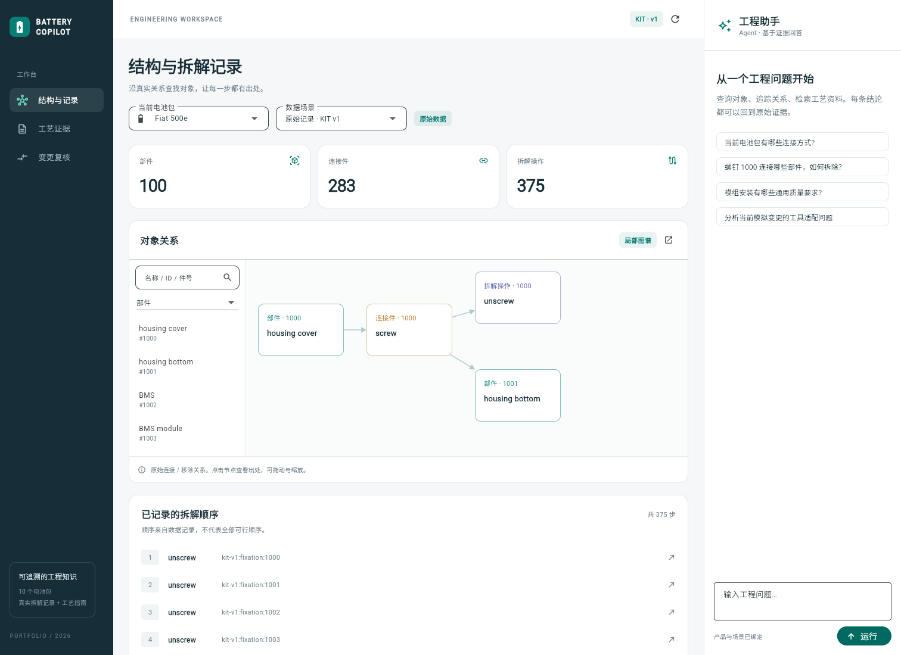

# Battery Engineering Copilot

电池工程知识图谱与证据助手，使用 FastAPI、Neo4j、Docling、LangChain/LangGraph 和 Flutter Web。

- 浏览电池部件、连接件及已记录拆解操作，追溯原始 CSV 行。
- 检索工艺指南，在 PDF 原页定位证据区域。
- 通过 Agent 调用领域工具，生成带引用的回答。
- 复核模拟规格变更，展示工具适配结果和关联对象。



## 安装与运行

当前安装脚本面向 Windows，需要 PowerShell 7、Git 和 [uv](https://docs.astral.sh/uv/getting-started/installation/)。

```powershell
git clone https://github.com/berlin6908/BatteryCopilot.git
Set-Location BatteryCopilot
pwsh -File scripts/setup.ps1
pwsh -File scripts/start-neo4j.ps1
```

安装脚本准备 Python 依赖、Neo4j、Java、Flutter 和指南 PDF。Neo4j 首次启动会创建本机 `.env`。
保持数据库终端运行，在另一个终端执行：

```powershell
$env:PYTHONUTF8 = '1'
uv run python -m battery_copilot.ingest
uv run python -m battery_copilot.documents
uv run python -m battery_copilot.retrieval
pwsh -File scripts/start.ps1
```

打开 [工作台](http://127.0.0.1:8000) 或 [API 文档](http://127.0.0.1:8000/docs)。
后续使用 `pwsh -File scripts/start.ps1` 启动；运行环境保存在 `.runtime` 和本机专用 Java 目录。
首次文档解析和向量索引会下载公开模型。

## 连接模型

本机演示支持 [Codex CLI](https://learn.chatgpt.com/docs/codex/cli)。安装后执行 `codex login`，在 `.env` 中配置：

```dotenv
MODEL_PROVIDER=codex
MODEL_NAME=gpt-5.6-terra
```

设置自己可用的模型名。后端通过 `codex exec --output-schema` 请求结构化工具选择，
LangGraph 执行领域工具；每轮 CLI 在独立临时目录中运行，不读取项目源码回答问题。
需要有效的 Codex 登录和可用额度。官方说明：[非交互调用](https://learn.chatgpt.com/docs/non-interactive-mode)。

也可使用支持 Chat Completions 工具调用的 API：

```dotenv
MODEL_PROVIDER=openai
OPENAI_BASE_URL=https://your-provider.example/v1
OPENAI_API_KEY=your-local-key
MODEL_NAME=your-tool-calling-model
```

修改配置后重启后端。图查询、证据浏览和模拟规则复核可以独立于生成模型使用。
服务默认仅监听本机；Codex 模式用于个人本地演示。

## 检查与评测

```powershell
$env:PYTHONUTF8 = '1'
uv run pytest -m 'not integration' -q
uv run ruff check backend
# Neo4j 与数据导入完成后：
uv run pytest -q
# 检索示例：
uv run python -m battery_copilot.evaluate --mode retrieval
```

前端检查和构建：

```powershell
Push-Location "$env:LOCALAPPDATA/BatteryCopilotProject/frontend"
../.runtime/flutter/bin/flutter.bat analyze
../.runtime/flutter/bin/flutter.bat build web --no-web-resources-cdn
Pop-Location
```

`scripts/smoke-browser.cjs` 使用 Playwright 和本机 Edge 检查网页流程，截图及结果写入
`data/runs/browser/`。设置 `LIVE_AGENT=1` 可额外检查真实模型问答。
评测执行器、示例题及评分格式见 [评测说明](docs/evaluation.md)。

## 目录

```text
backend/             Python 源码与测试
frontend/            Flutter 源码与 Web 配置
scripts/             安装、启动、浏览器检查和评测汇总
data/                示例场景、评测题和公开源数据
docs/                架构、评测说明和界面预览
```

`.env`、运行环境、文档解析产物、模型运行日志和本地开发资料均不进入版本控制。
架构及工具设计见 [架构说明](docs/architecture.md)。

## 数据来源与范围

KIT / WBK：Marina Baucks、Alexander Morasch；贡献者 Sebastian Henschel、Jürgen Fleischer。
[数据 DOI](https://doi.org/10.35097/emz24pksshndq468)，CC BY 4.0。10 个电池包的原始 CSV
及署名位于 [data/sources/kit-battery](data/sources/kit-battery/ATTRIBUTION.md)。

PEM / RWTH Aachen / VDMA：[Production Process of Battery Modules and Battery Packs](https://publications.rwth-aachen.de/record/973056/)。
安装脚本下载指南；PDF 与完整页图保存在本地，不随代码发布。

KIT 数据提供结构和拆解记录，NEXT 表示记录顺序。指南是通用资料，不能证明指定车型参数。
变更规格及工具卡明确标为模拟数据。图中关联对象用于复核，不代表已经验证的制造影响。

当前 Agent 仍可能在分类总数加总和引用完整性上出错；引用 ID 存在也不自动证明结论受证据支持。
