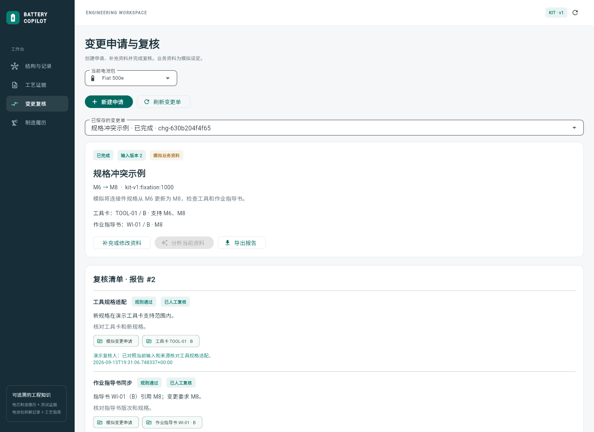

# Battery Engineering Copilot

电池工程知识图谱与证据助手，使用 FastAPI、Neo4j、Docling、LangChain/LangGraph 和 Flutter Web。

- 基于 KIproBatt 实际电芯试制数据，追溯电芯前驱、制造过程和已填写参数。
- 核对循环测试原始行，生成有引用的制造复核报告，保存人工意见并导出来源快照。
- 浏览电池部件、连接件及已记录拆解操作，追溯原始 CSV 行。
- 检索工艺指南，在 PDF 原页定位证据区域。
- 通过 Agent 调用领域工具，生成带引用的回答。
- 保存变更申请，检查工具卡、作业指导书和关联对象，补充资料后重新分析。
- 逐项记录人工复核，完成变更单并导出带来源和版本的 Markdown 报告。


[三分钟演示与简历表述](docs/demo.md) · [制造验证结果](docs/manufacturing-validation.md) ·
[指南引用与检索验证](docs/guide-validation.md) · [安装与交付验证](docs/delivery-check.md)

## 安装与运行

当前安装脚本面向 Windows，需要 PowerShell 7、Git 和 [uv](https://docs.astral.sh/uv/getting-started/installation/)。

```powershell
git clone https://github.com/berlin6908/BatteryCopilot.git
Set-Location BatteryCopilot
pwsh -File scripts/setup.ps1
pwsh -File scripts/start-neo4j.ps1
```

安装脚本准备 Python 依赖、Neo4j、Java、Flutter 和指南 PDF。Neo4j 首次启动会创建本机 `.env`。
保持数据库终端运行，在另一个终端执行：

```powershell
$env:PYTHONUTF8 = '1'
uv run python -m battery_copilot.ingest
uv run python -m battery_copilot.documents
uv run python -m battery_copilot.retrieval
uv run python -m battery_copilot.manufacturing_ingest
pwsh -File scripts/start.ps1
```

打开 [工作台](http://127.0.0.1:8000) 或 [API 文档](http://127.0.0.1:8000/docs)。
后续使用 `pwsh -File scripts/start.ps1` 启动；运行环境保存在 `.runtime` 和本机专用 Java 目录。
首次文档解析和向量索引会下载公开模型。

## 连接模型

本机演示支持 [Codex CLI](https://learn.chatgpt.com/docs/codex/cli)。安装后执行 `codex login`，在 `.env` 中配置：

```dotenv
MODEL_PROVIDER=codex
MODEL_NAME=gpt-5.6-terra
```

设置自己可用的模型名。后端通过 `codex exec --output-schema` 请求结构化工具选择，
LangGraph 执行领域工具；每轮 CLI 在独立临时目录中运行，不读取项目源码回答问题。
需要有效的 Codex 登录和可用额度。官方说明：[非交互调用](https://learn.chatgpt.com/docs/non-interactive-mode)。

也可使用支持 Chat Completions 工具调用的 API：

```dotenv
MODEL_PROVIDER=openai
OPENAI_BASE_URL=https://your-provider.example/v1
OPENAI_API_KEY=your-local-key
MODEL_NAME=your-tool-calling-model
```

修改配置后重启后端。图查询、证据浏览和申请保存可以独立于生成模型使用，变更分析需要模型。
服务默认仅监听本机；Codex 模式用于个人本地演示。

## 体验制造履历与检验复核

默认进入「制造履历」。选择测试关联电芯，展开「制造履历」中的工序参数，
在「循环测试记录」中查看充放电容量、翻页并点击原始行证据。
点击「生成制造复核报告」后，Agent 自行调用履历、过程参数、测试和来源读取工具。
报告保存到 Neo4j；刷新后从「已保存报告」重新打开，填写人工复核意见并导出 Markdown。

默认样本 `FormatedCell1 · 101_tizue-ki-230306-tizue-0400-059_-STATS-.txt`
可明确回溯到叠片产出的干电芯、注液和化成过程。
循环 1 的原始放电容量为 **0.438290374336 Ah**，可在文件第 11 行核对。
更上游的电极料盒存在过程记录，但没有连接到该电芯的明确对象前驱，页面显示追溯终点。
测试包含不同阶段；当前数据不足以由首末容量之比判断 SOH、制造缺陷或合格性。

制造导入固定在 KIproBatt v0.3.2：718 个过程实例、24,577 个源节点、108 份循环统计。
这些文件关联 109 个图谱对象，其中一份被两个对象引用；对象数不代表独立物理电芯数。
使用公共实验室制造数据，未声称接入工业量产系统。
下载约 78 MB 归档，校验后导入；也可传 `--archive <本地归档路径>`。
原始归档不上传 GitHub，详见 [来源与转换说明](data/sources/kiprobatt/ATTRIBUTION.md)。


## 体验变更流程

进入「变更复核」→「新建申请」，选择正常、缺资料或冲突示例，编辑并保存申请。
点击「分析当前资料」后，系统列出工具规格适配、指导书同步和关联对象三项检查，
Agent 根据来源解释检查结果。

- 正常示例：查看条目证据，填写复核人及意见，逐项确认后完成变更单。
- 缺资料示例：补充工具卡并重新分析；缺失项不能直接确认通过。
- 冲突示例：更新工具卡支持规格与版次，再重新分析和复核。

变更单保存在 Neo4j，刷新后可以继续处理。修改资料会生成新输入版本，
旧报告和复核记录保留在历史报告中。当前报告可导出，尚未完成的报告会标明实际状态。
模型调用失败时申请仍保留，可点击「重试分析」。



## 检查与评测

```powershell
$env:PYTHONUTF8 = '1'
uv run pytest -m 'not integration' -q
uv run ruff check backend
# Neo4j 与数据导入完成后：
uv run pytest -q
# 检索示例：
uv run python -m battery_copilot.evaluate --mode retrieval
# 当前指南的页码与原文区域检索验证：
uv run python -m battery_copilot.guide_evaluation --output data/runs/guide-validation.json
```

前端检查和构建：

```powershell
$projectPath = & ./scripts/project-path.ps1
Push-Location (Join-Path $projectPath 'frontend')
../.runtime/flutter/bin/flutter.bat analyze
../.runtime/flutter/bin/flutter.bat build web --no-web-resources-cdn
Pop-Location
```

`scripts/smoke-browser.cjs` 使用 Playwright 和本机 Edge 检查网页流程，截图及结果写入
`data/runs/browser/`。设置 `LIVE_AGENT=1` 会通过 `scripts/smoke-cases.cjs` 检查三种变更流程、
资料补充、刷新恢复、人工复核与报告下载，并额外检查真实模型问答。
评测执行器、示例题及评分格式见 [评测说明](docs/evaluation.md)。

`scripts/smoke-manufacturing.cjs` 检查制造履历、循环原始行与分页；设置 `LIVE_AGENT=1`
还会实际调用模型，检查报告保存、刷新恢复及含来源的导出；再设置 `TEST_REVIEW=1`
会填写标为自动化测试的复核意见，适用于独立测试数据库。两个脚本都支持 `BASE_URL`，
默认为 `http://127.0.0.1:8000`，均需可解析的 Playwright
Node 包和本机 Edge。制造功能的数值与对象范围测试位于 `backend/tests/test_manufacturing.py`。
原 300 题不覆盖 KIproBatt 制造业务。

工艺指南采用 PDF 版本、页码和区域引用，解析分块变化后仍可读取原引用。
新增图中文字提取和多语言重排后，干净安装的原 8 道页检索探针为 8/8；
另 4 个业务意图的中英德表达共 12 问，目标页命中 10/12、原文区域命中 9/12。
这些是已查看问题后的修复验证。失败、分步对照和 CPU 延迟见[指南验证](docs/guide-validation.md)。

当前制造验证包含8道已知回归题和24道同批次新对象题，固定对照也能定位题目要求的循环。
两轮各96次尝试，保留修复前后的答案、引用评分、开销和来源抽查。
首次新对象验证中，Agent字段通过24/24、字段及预设引用通过23/24，固定查询为23/24、23/24；
来源抽查还发现了自动评分未识别的参数归属错误，已补充对象绑定并验证修复。
最终重放中两种有资料策略均为24/24，但Agent查询54次、模型调用71次，
固定查询分别为152次、48次，Agent中位耗时也更高。
这是看过问题后的修复验证，不是新的盲测，未证明Agent准确率超过固定流程。
完整题库、来源、失败分析与重现命令见[制造验证报告](docs/manufacturing-validation.md)。

制造功能另有 [36 个来源核查案例](data/manufacturing-benchmark/cases.json)，
覆盖 12 个测试批次；6 题开发检查、30 题冻结评测。
对比无资料、固定工艺档案与 Agent，检查真实参数、循环定位、资料缺口和判断边界，
详细范围及重现命令见 [制造业务诊断协议](docs/manufacturing-benchmark.md)。
已使用 Terra 完成108次尝试；30题冻结评测中，Agent严格字段通过27/30、
字段及预设引用通过24/30，固定档案分别为22/30、20/30。
格式问题、采样缺口和分页错误分别记录在 [制造诊断实测结果](docs/manufacturing-results.md)；
这是单电芯资料核查的小规模诊断，不代表工业业务准确率。

旧300案例、60/240开发测试划分及三方案对照见[历史评测协议](docs/benchmark-300.md)。
题库包含原始来源、确定答案和模拟业务修订流程，可独立重新生成。
指南成绩依赖当时的703元素解析快照；新安装重新解析PDF可能改变元素编号和分块，
因此不能直接复现旧指南成绩。执行器会在解析指纹不一致时停止该评测，详见协议。

历史运行使用Terra完成900次案例测试。240题测试集的答案及引用通过率：
固定 RAG **45.42%**，固定图查询与规则 **90.83%**，Agent **86.25%**。
Agent 在连接关系和记录顺序上更好，固定流程在指南整页定位上更好；
两者的工具策略与实际调用量不同。另有 50 个保存变更流程通过自动重放。
完整分项、耗时和适用范围见 [实测报告](docs/benchmark-results.md)。

## 目录

```text
backend/             Python 源码与测试
frontend/            Flutter 源码与 Web 配置
scripts/             安装、启动、浏览器检查和评测汇总
data/                示例场景、评测题和公开源数据
docs/                架构、评测说明和界面预览
```

`.env`、运行环境、文档解析产物、模型运行日志和本地开发资料均不进入版本控制。
架构及工具设计见 [架构说明](docs/architecture.md)。

## 数据来源与范围

项目源码采用[MIT许可证](LICENSE)。第三方数据、指南与依赖保留各自许可；
源码许可证不改变下面列出的数据使用条件。

KIproBatt：[v0.3.2 数据归档](https://zenodo.org/records/11895571)，CC BY 4.0。
实验室电芯制造过程、对象、参数及测试导出，作者署名见
[ATTRIBUTION](data/sources/kiprobatt/ATTRIBUTION.md)。本轮未纳入另 13 份非循环统计导出，
未下载源平台外部图片，也未把未解析的过程状态判为成功完工。

KIT / WBK：Marina Baucks、Alexander Morasch；贡献者 Sebastian Henschel、Jürgen Fleischer。
[数据 DOI](https://doi.org/10.35097/emz24pksshndq468)，CC BY 4.0。10 个电池包的原始 CSV
及署名位于 [data/sources/kit-battery](data/sources/kit-battery/ATTRIBUTION.md)。

PEM / RWTH Aachen / VDMA：[Production Process of Battery Modules and Battery Packs](https://publications.rwth-aachen.de/record/973056/)。
安装脚本下载指南；PDF 与完整页图保存在本地，不随代码发布。

KIT 数据提供结构和拆解记录，NEXT 表示记录顺序。指南是通用资料，不能证明指定车型参数。
变更规格、工具卡和指导书输入明确标为模拟数据。图中关联对象用于复核，不代表已经验证的制造影响。

数量统计由图查询结果确定性加总，Agent 直接使用总数；引用未取回的证据时会收到补查反馈。
引用 ID 存在不自动证明结论受证据支持，也不保证覆盖问题要求的全部对象。
变更单完成表示给定资料的三项检查已通过并记录人工复核，不代表实际生产放行。
