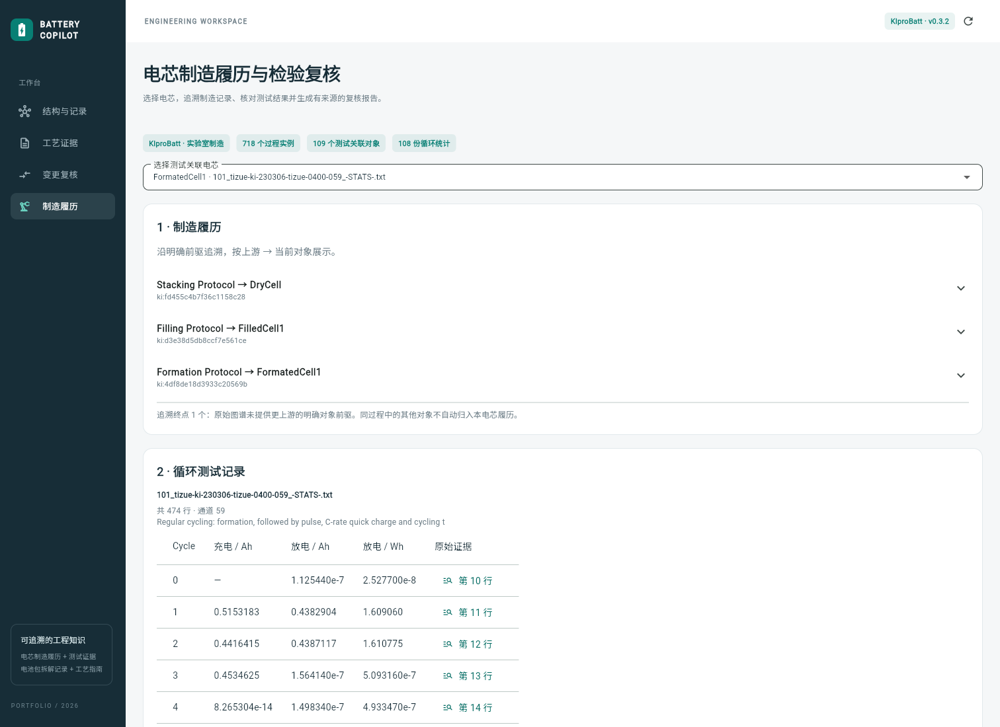
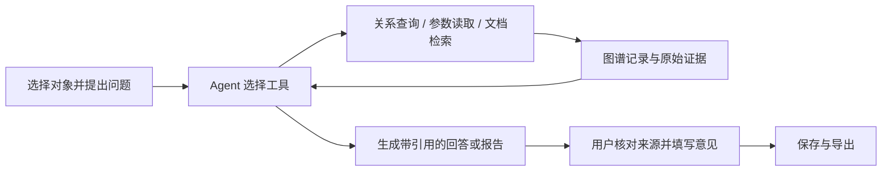
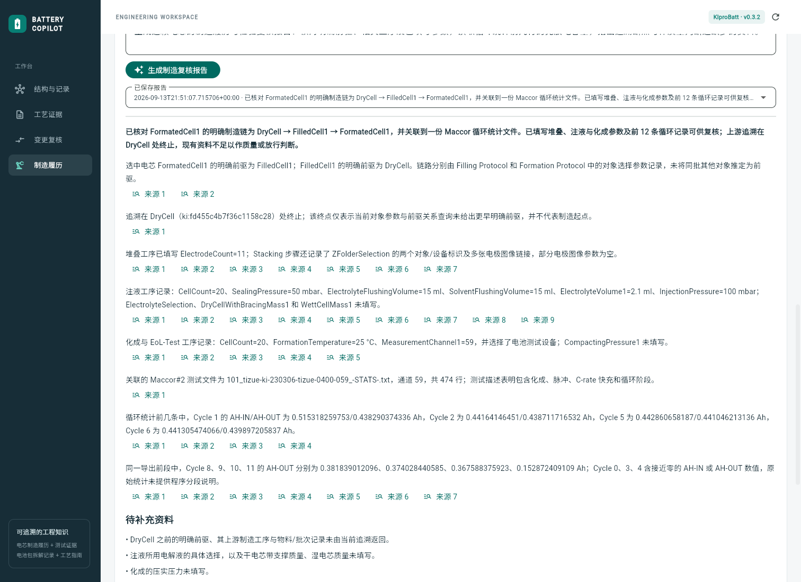

# Battery Engineering Copilot

> 连接制造履历、测试记录与工艺文档，让工程问题的回答有据可查。

[使用指南](docs/usage.md) · [系统架构](docs/architecture.md) · [开发与测试](docs/development.md) ·
[评测](docs/evaluation.md) · [版本发布](https://github.com/berlin6908/BatteryCopilot/releases)

## 项目简介

核对一个电芯的制造过程，往往需要同时查看工序记录、循环测试文件和工艺指南。
这些资料分别回答“经过哪些工序”“记录了哪些参数”“测试值来自哪里”，
需要沿对象关系和原始记录把它们串起来，才能形成可复核的结论。

Battery Engineering Copilot 将结构化记录导入知识图谱，为文档建立多语言检索索引，
由 Agent 根据问题选择工具、读取资料并生成带引用的回答。
用户可以在同一个工作台追溯电芯、核对原始行、查看 PDF 证据，并保存人工复核意见和报告。

项目面向制造资料核查、测试证据整理、部件关系查询和变更资料复核，
使用 KIproBatt、KIT 与 PEM 的公开数据；变更流程提供模拟工具卡和作业指导书示例。



[观看三分钟演示](https://github.com/berlin6908/BatteryCopilot/releases/download/v0.1.0/battery-copilot-demo.mp4)：
从电芯履历出发，完成来源核对、报告恢复、人工复核和导出。

## 核心功能

| 功能 | 可以完成的任务 | 输出与证据 |
| --- | --- | --- |
| 制造履历 | 选择电芯，追溯明确前驱、制造工序及对应参数 | 对象关系、工序参数与原始 JSON-LD 属性 |
| 检验复核 | 按循环编号核对测试值，生成报告并填写复核意见 | 循环原始行、逐条引用、可导出的来源快照 |
| 结构查询 | 浏览电池包部件、连接件和拆解记录 | 局部关系图、记录序列与原始 CSV 行 |
| 工艺检索 | 用中文、英文或德文检索生产指南 | PDF 原页、证据区域高亮与对应原文 |
| 变更复核 | 提交变更、补充资料、检查规格并逐项确认 | 输入版本、冲突或缺失项、历史报告与复核记录 |

## Agent 如何工作

用户选择电芯或电池包后，系统将当前对象绑定到领域工具。
Agent 读取问题，自行决定先追溯关系、查询参数还是读取测试行，并根据返回结果继续取证。
关系范围、统计和数值读取由工具完成；模型负责选择查询、组织结论和说明资料缺口。



以制造报告为例，Agent 可以调用履历追溯、工序参数、测试分页、指定循环和原始来源五个工具。
回答中的引用需来自已取回的证据；用户可以点击引用回到原始记录。
人工复核由用户在界面提交，模型负责提供待复核的报告。

图模式、工具循环、引用校验和变更状态流转见[系统架构](docs/architecture.md)。

## 技术栈

| 层次 | 技术 | 用途 |
| --- | --- | --- |
| Web 工作台 | Flutter Web、graphview | 关系图、来源查看、问答与复核表单 |
| API 与数据模型 | Python、FastAPI、Pydantic | 业务接口、流式响应和结构化校验 |
| Agent 编排 | LangChain、LangGraph | 工具调用循环与结构化回答 |
| 图存储与检索 | Neo4j、Neo4j GraphRAG | 对象关系、参数化查询、全文与向量索引 |
| 数据与文档解析 | RDFLib、Docling、PDFium | JSON-LD 导入、PDF 布局与区域原文读取 |
| 多语言检索 | multilingual-e5-small、mMARCO MiniLM CrossEncoder | 向量编码与指南候选重排 |
| 生成模型 | 支持工具调用的 Chat Completions API / Codex CLI | 选择工具、组织回答与生成报告 |

## 快速开始

### 环境要求

- Windows、PowerShell 7、Git。
- [uv](https://docs.astral.sh/uv/getting-started/installation/)，用于安装 Python 与项目依赖。
- 生成报告需要可用的模型 API，或本机已登录的 Codex CLI。

安装脚本使用 Python 3.11，并准备 Java、Neo4j、Flutter 和工艺指南 PDF。
首次安装、解析和索引需要联网下载运行环境、公开模型与数据。

### 1. 安装并启动数据库

```powershell
git clone https://github.com/berlin6908/BatteryCopilot.git
Set-Location BatteryCopilot
pwsh -File scripts/setup.ps1
pwsh -File scripts/start-neo4j.ps1
```

保持数据库终端运行，后续命令在另一个 PowerShell 终端的项目目录执行。

### 2. 配置生成模型

Neo4j 首次启动时会创建本地 `.env`。编辑其中的模型配置，保留已有数据库连接信息。

支持使用 Chat Completions 工具调用接口：

```dotenv
MODEL_PROVIDER=openai
OPENAI_BASE_URL=https://your-provider.example/v1
OPENAI_API_KEY=your-api-key
MODEL_NAME=your-tool-calling-model
```

也支持本机已登录的 Codex CLI：

```dotenv
MODEL_PROVIDER=codex
MODEL_NAME=gpt-5.6-terra
```

使用 CLI 前执行 `codex login`，并将模型名改为账号可用的模型。
后端通过独立的 `codex exec` 进程调用模型，详见[模型适配](docs/architecture.md#模型适配)。
修改配置后重启后端。制造履历、原始证据和文档检索可以独立使用；
报告生成、工程问答和变更分析需要配置生成模型。

### 3. 导入数据并启动工作台

首次运行时导入结构记录、解析指南、建立检索索引，再导入制造履历与循环文件：

```powershell
$env:PYTHONUTF8 = '1'
uv run python -m battery_copilot.ingest
uv run python -m battery_copilot.documents
uv run python -m battery_copilot.retrieval
uv run python -m battery_copilot.manufacturing_ingest
pwsh -File scripts/start.ps1
```

KIproBatt 导入会下载约 78 MB 的数据归档。
完成后打开 [工作台](http://127.0.0.1:8000) 或 [API 文档](http://127.0.0.1:8000/docs)。
后续直接运行 `pwsh -File scripts/start.ps1`，无需重复导入。

## 使用示例

### 核对一个电芯的制造履历与循环数据

在「制造履历」中选择默认样本 `FormatedCell1`，在「复核任务」输入：

> 追溯当前电芯的明确前驱和制造工序，核对 Cycle 1 的充放电容量，
> 列出缺失的工艺参数与测试条件。每条结论给出来源，并说明现在能否作质量判定。

该样本关联文件为 `101_tizue-ki-230306-tizue-0400-059_-STATS-.txt`。
以下是可对照来源核实的结果要点，报告的具体措辞随模型生成而变化：

| 核对项 | 来源中的结果 |
| --- | --- |
| 明确前驱链 | DryCell → FilledCell1 → FormatedCell1 |
| 工序与产物 | Stacking → DryCell；Filling → FilledCell1；Formation → FormatedCell1 |
| Cycle 1 放电容量 | 0.438290374336 Ah，位于循环文件第 11 行 |
| 追溯终点 | 当前明确前驱关系在 DryCell 终止，不能据此认定它是制造起点 |

生成报告后，点击「来源」核对结论，填写人工意见，再导出 Markdown。
报告保留引用证据快照，刷新后可从「已保存报告」继续查看。



### 查询部件关系或工艺证据

| 页面 | 示例输入 | 查看内容 |
| --- | --- | --- |
| 结构与记录 | 螺钉 1000 连接哪些部件，如何拆除？ | 部件关系、拆解操作及 CSV 来源 |
| 工艺证据 | 产线布局中的缓冲站和返工区域 | 指南原页及高亮证据区域 |
| 变更复核 | 新建 M6 → M8 的规格变更，并填写工具卡和指导书 | 工具适配、指导书同步、资料缺口与逐项复核 |

四个页面的完整操作步骤见[使用指南](docs/usage.md)。

## 评测结果

制造资料核查与指南检索分别评测，题库、来源标注、运行配置和失败分析随结果公开。
以下为已有版本的开发验证记录：

| 评测 | 样本与口径 | 结果 | 详细记录 |
| --- | --- | --- | --- |
| 制造核查 v2 修复重放 | 24 道同批次新对象题；字段及预设引用均通过 | 固定查询 24/24；Agent 24/24 | [制造验证](docs/manufacturing-validation.md) |
| 指南原开发探针 | 8 问；正确页进入前 6 条结果 | 8/8 | [指南验证](docs/guide-validation.md) |
| 指南新增意图 | 4 个意图的中英德表达，共 12 问；页与原文区域 Hit@6 | 页命中 10/12；区域命中 9/12 | [题库与结果](data/guide-validation/) |
| PDF 引用稳定性 | 重新解析后不再出现在索引中的 25 个旧区域 | 25/25 可从同版本 PDF 打开 | [核对记录](data/guide-validation/region-stability.json) |

在上述制造重放中，Agent 共执行 54 次资料查询，固定流程为 152 次；
中位耗时分别为 17.86 秒和 13.28 秒。Agent 使用更少的资料查询，但需要更多模型轮次。

这些问题在开发中已被查看，结果属于修复验证，且制造样本来自已见批次。
字段和预设引用通过率用于检查规定任务，回答的语义支持仍需对照来源复核。
历史 300 题的协议与结果、当前评测重现命令统一收录在[评测文档](docs/evaluation.md)。

## 数据来源

| 数据集 | 用途 | 来源与许可 |
| --- | --- | --- |
| KIproBatt v0.3.2 | 电芯试制履历、过程参数、循环统计 | [数据归档](https://zenodo.org/records/11895571) · [署名与转换说明](data/sources/kiprobatt/ATTRIBUTION.md) · CC BY 4.0 |
| KIT / WBK | 电池包结构、连接件、拆解记录 | [数据 DOI](https://doi.org/10.35097/emz24pksshndq468) · [署名](data/sources/kit-battery/ATTRIBUTION.md) · CC BY 4.0 |
| PEM / RWTH Aachen / VDMA | 电池模组与电池包生产工艺指南 | [原始出版物](https://publications.rwth-aachen.de/record/973056/) · PDF 与页图由安装过程下载、生成，不随源码分发 |

制造数据来自公开实验室记录，指南提供通用工艺知识；变更示例中的规格、工具卡和指导书是模拟输入。
系统用于资料追溯与复核，报告中的质量判断仍取决于测试条件、验收标准和人工确认。

## 项目结构

```text
BatteryCopilot/
├── backend/
│   ├── src/battery_copilot/  # API、Agent、领域工具与数据导入
│   └── tests/               # 后端单元与集成检查
├── frontend/                # Flutter Web 工作台
├── scripts/                 # 安装、启动、浏览器检查与评测工具
├── data/                    # 数据署名、示例场景、评测题库与结果
├── docs/                    # 使用、架构、开发与评测文档
├── .env.example             # 数据库与模型配置示例
├── pyproject.toml           # Python 依赖与项目配置
└── uv.lock                  # Python 依赖锁文件
```

本地配置、运行环境、解析缓存和原始运行日志不进入版本控制。

## 开发与贡献

欢迎通过 [Issues](https://github.com/berlin6908/BatteryCopilot/issues) 反馈问题，
或提交 Pull Request。反馈请附复现步骤和去除密钥的错误信息；提交修改时说明行为变化与验证方式。

后端检查：

```powershell
uv run ruff check backend
uv run pytest -m 'not integration' -q
# 数据库启动且数据导入完成后，运行全部检查：
uv run pytest -q
```

[开发文档](docs/development.md)包含前端构建、浏览器检查、数据更新和录制命令。
[版本验证记录](docs/validation.md)提供独立安装、数据导入与完整工作流的检查结果。

## 许可证

源码采用 [MIT License](LICENSE)。第三方数据、文档和依赖保留各自许可与署名要求。
