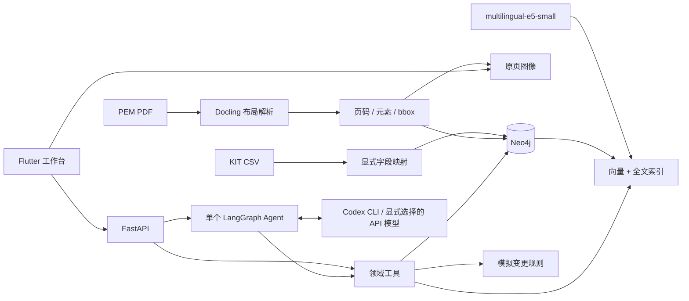

# 架构与面试讲解

## 一条完整请求

Flutter 选择产品和场景 → FastAPI → 绑定上下文的领域工具 → Neo4j → 带出处的结果。
用户输入开放问题后，LangChain `create_agent` 在 LangGraph 上运行一个工具循环，
根据中间结果继续取证。结构化回答含结论、证据 ID、适用范围、资料缺口和下一步建议。
运行轨迹保存为 JSON。没有自建 Agent 框架或多 Agent 消息总线。

生成模型当前使用 `CodexChatModel`：继承 LangChain `BaseChatModel`，把绑定工具的
JSON Schema 和消息记录传给本机已登录的 `codex exec`。CLI 只返回工具选择，
LangGraph 执行查询并把结果送入下一轮，最终由 `ToolStrategy(Answer)` 生成回答。
CLI 的 JSONL 事件提供 token 统计；错误直接返回，不切换到其他服务。
这不是将当前聊天窗口转成 HTTP API，也不是复用聊天历史。当前固定模型是 `gpt-5.6-terra`。



## 图模式

`kit-v1:part:1000` 与 `kit-v1:fixation:1000` 是不同对象。节点共享 Evidence 标签以便引用，
结构节点另有 Record 和具体类型标签。UID 有唯一约束。

```text
Battery -CONTAINS-> Part / Fixation
Part -FROM_PART-> Fixation -TO_PART-> Part
Part / Fixation -REMOVED_BY-> Operation -NEXT-> Operation
Document -HAS_EVIDENCE-> Guide
```

结构节点保留 source_file、source_line、raw_record、snapshot_id。
Guide 保留 element_ref、page、bbox、page_width、page_height、source_kind。
文档 bbox 转为左上原点、0–1 坐标，界面按实际画布尺寸定位。

## 为什么这些组件值得保留

- Neo4j：关系和计数由参数化 Cypher 完成；同时托管全文与向量索引，无需第二个数据库。
- Docling：保存元素和页内坐标。Windows 使用其 PyPdfium 后端，布局模型仍是标准管线。
- E5：CPU 上的真实多语言向量，384 维；query/passage 前缀按模型约定分开。
- Neo4j GraphRAG：直接复用 HybridRetriever，不重写混合检索。
- LangChain：直接复用工具调度和结构化输出；不让模型执行任意 Cypher。
- Flutter：适配岗位要求，并复用 graphview；PDF 来源用原页图 + 归一化区域高亮。

## 实际遇到的质量问题

1. 数字 ID 跨实体重复：以类型和快照组成 UID，保留官方关系方向。
2. PDF 双栏阅读顺序不等于栏目归属：用同页标题与元素位置关联栏目，
   并以第 18 页左右两栏做回归检查。复杂嵌套布局仍需人工核对。
3. 重复栏目标题污染检索：标题保留为可查证据，但不作为独立检索候选；
   为正文补充页主题和所属栏目。
4. 无实际车型参数：不从示意图估测尺寸，也不把通用知识绑定到车型事实。

## 当前可解释的限制

关系工具默认展开一跳、最多 40 条，Agent 可继续查询下一对象。完整图不直接塞入上下文。
指南查询使用独立的 GuideChunk 标签索引，避免大量 CSV 候选挤掉文档证据。
混合跨来源查询先取 100 个候选，再按产品筛选；更多产品时需要数据库侧产品过滤。
当前只检查引用来自已返回证据，尚不能自动证明每句话被其语义支持。
图文能力是元素检索、页面与区域定位；没有宣称视觉模型已理解示意图。
Codex 模式每轮启动一个短生命周期进程，存在启动与上下文开销，适合本机演示。
已完成真实工具循环联调；长问题成功率仍需独立测试集验证。
