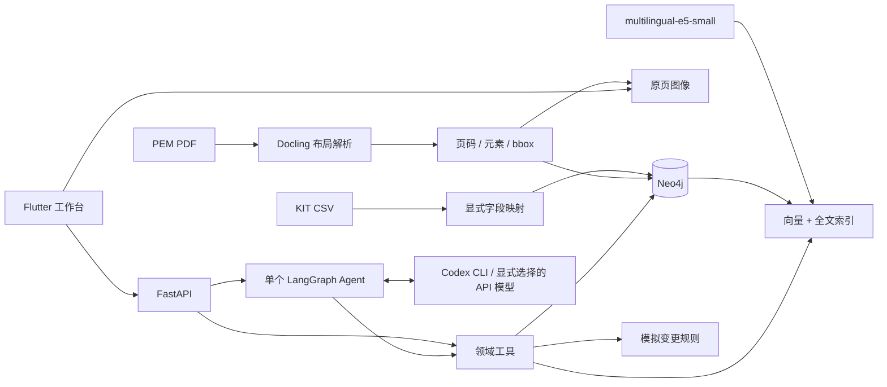
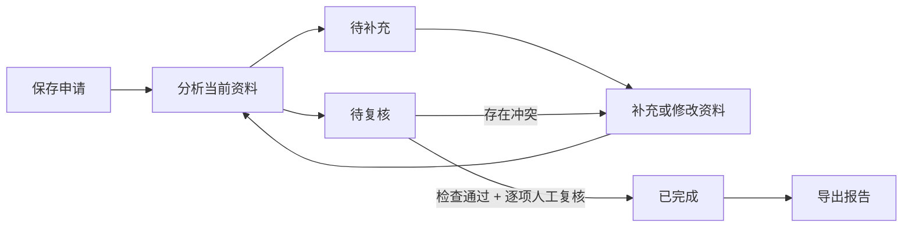

# 架构与面试讲解

## 一条完整请求

Flutter 选择产品和场景 → FastAPI → 绑定上下文的领域工具 → Neo4j → 带出处的结果。
用户输入开放问题后，LangChain `create_agent` 在 LangGraph 上运行一个工具循环，
根据中间结果继续取证。结构化回答含结论、证据 ID、适用范围、资料缺口和下一步建议。
运行轨迹保存为 JSON。没有自建 Agent 框架或多 Agent 消息总线。

生成模型当前使用 `CodexChatModel`：继承 LangChain `BaseChatModel`，把绑定工具的
JSON Schema 和消息记录传给本机已登录的 `codex exec`。CLI 只返回工具选择，
LangGraph 执行查询并把结果送入下一轮，最终由 `ToolStrategy(Answer)` 生成回答。
CLI 的 JSONL 事件提供 token 统计；错误直接返回，不切换到其他服务。
这不是将当前聊天窗口转成 HTTP API，也不是复用聊天历史。当前固定模型是 `gpt-5.6-terra`。

统计工具同时返回分类明细和确定性总数。`before_model` 中间件收集成功工具返回的证据 ID，
结构化回答的 Pydantic 校验器检查引用；缺失引用通过 LangChain 的 `ToolStrategy` 反馈回工具循环，
让模型补读来源。循环仍受 24 步限制，没有另建重试框架。



## 图模式

### 制造履历

`manufacturing_ingest.py` 用 RDFLib 解析固定版本 JSON-LD，保留原始 IRI、来源文件、
RDF 属性及含原单位的 `HasValue`。独立的 `MfgRecord` / `MfgTest` 标签和 UID 索引
承载制造数据，复用 Evidence 引用与 Neo4j 数据库。KIT 的拆解标签和顺序含义保持独立。

```text
Parameter -FOR_OBJECT-> OutputObject
Parameter -SOURCE_OBJECT-> PredecessorObject
OutputObject -DERIVED_FROM {evidence_uid: Parameter.uid}-> PredecessorObject
Object -OUTPUT_OF-> Process <-STEP_OF- Step <-FOR_STEP- Parameter
Object -HAS_TEST {evidence_uid: FileParameter.uid}-> MfgTest
```

`DERIVED_FROM` 是由原始对象参数的两个明确关系投影出来的边，不是模型推断。
按这条边最多追溯 30 跳；同批其他输出、内部中间对象不会自动归入电芯履历。
过程详情只返回该履历对象的参数及未绑定其他对象的共享参数。
终点表示缺少进一步明确关系，不意味着该对象就是制造起点。

循环统计使用标准 CSV 库读取制表符、小数逗号和科学计数法，空值保留为 null。
行证据 ID 为 `ki:<文件哈希>:L<原始行号>`。保存文件 SHA-256、头部元数据和原始单元格。
一个文件可能被多个图谱对象引用，工具显式返回全部关联对象；不据此计算独立电芯数。
ACR/DCIR 和 Date 保留来源值，不推定单位、日期时区或测试阶段。

`manufacturing.py` 的四个工具绑定选中电芯，复用 `agent.py` 的 `stream_answer` 循环、
结构化回答和引用校验。工具决定数据范围和计算口径，模型决定取证次序与报告内容。
生成上限为 10 次模型调用、16 次领域工具调用；未得到完整答案就返回错误。
`MfgReport` 保存任务、数据版本、结构化答案和被引用证据快照，人工意见单独保存一次。
模型不能调用人工复核接口。导出支持未复核的报告，并保留实际复核状态和来源。
该闭环用于资料复核，未加入制造执行、质量放行或工艺优化控制。

`run_analysis` 执行同一取证循环，`run_report` 在结果完整后保存报告；制造评测调用前者，
从而检查产品实际策略，并避免评测回答混入用户报告列表。标准答案从原始归档独立读取，
不调用生产图查询；固定档案策略同样使用生产资料接口，按声明的首尾页采样流程取证。

### 拆解与指南

`kit-v1:part:1000` 与 `kit-v1:fixation:1000` 是不同对象。节点共享 Evidence 标签以便引用，
结构节点另有 Record 和具体类型标签。UID 有唯一约束。

```text
Battery -CONTAINS-> Part / Fixation
Part -FROM_PART-> Fixation -TO_PART-> Part
Part / Fixation -REMOVED_BY-> Operation -NEXT-> Operation
Document -HAS_EVIDENCE-> Guide
```

结构节点保留 source_file、source_line、raw_record、snapshot_id。
Guide 保留 element_ref、page、bbox、page_width、page_height、source_kind。
文档 bbox 转为左上原点、0–1 坐标，界面按实际画布尺寸定位。

## 变更申请与复核



`cases.py` 管理申请、版本和复核，`case_api.py` 提供操作接口；Flutter 表单与工作台分别位于
`case_form.dart` 和 `cases.dart`。复用 Neo4j 保存 `ChangeCase`，每张单据存一份包含输入和历史报告
的 JSON 文档，另存列表查询需要的标题、产品、状态和时间。当前规模不需要第二个数据库或工作流引擎。

- 输入包括变更对象、原因、原/新规格，以及可缺省的工具卡、作业指导书及其版次。
- 规则代码负责适配检查；图查询返回直接关联对象。Agent 通过工具读取这些结果并解释来源。
- 每份报告冻结本次输入、证据、规则结果、Agent 回答和人工复核记录。
- 修改输入或重新分析会撤下当前报告；旧报告保留，但不能用于当前版本的复核和完成。
- 只有全部规则通过且每项有人工复核记录时，后端才允许完成。模型不调用复核或完成接口。
- 写入使用事务和版本号，旧页面提交返回 409。分析记录独立运行 ID，迟到的结果不能覆盖更新后的输入。

分析在 FastAPI 同步请求的线程中执行，页面断开不会主动取消模型调用。服务重启中断的分析
可以显式重试，不提供后台任务队列。复核人是本地演示填写的姓名，尚未接入账号与审批权限。
工具适配按填写的规格列表检查，指导书按新规格匹配；这是一条范围明确的资料复核流程。

## 为什么这些组件值得保留

- Neo4j：关系和计数由参数化 Cypher 完成；同时托管全文与向量索引，无需第二个数据库。
- Docling：保存元素和页内坐标。Windows 使用其 PyPdfium 后端，布局模型仍是标准管线。
- E5：CPU 上的真实多语言向量，384 维；query/passage 前缀按模型约定分开。
- Neo4j GraphRAG：直接复用 HybridRetriever，不重写混合检索。
- LangChain：直接复用工具调度和结构化输出；不让模型执行任意 Cypher。
- Flutter：适配岗位要求，并复用 graphview；PDF 来源用原页图 + 归一化区域高亮。

## 实际遇到的质量问题

1. 数字 ID 跨实体重复：以类型和快照组成 UID，保留官方关系方向。
2. PDF 双栏阅读顺序不等于栏目归属：用同页标题与元素位置关联栏目，
   并以第 18 页左右两栏做回归检查。复杂嵌套布局仍需人工核对。
3. 重复栏目标题污染检索：标题保留为可查证据，但不作为独立检索候选；
   为正文补充页主题和所属栏目。
4. 无实际车型参数：不从示意图估测尺寸，也不把通用知识绑定到车型事实。

## 当前可解释的限制

关系工具默认展开一跳、最多 40 条，Agent 可继续查询下一对象。完整图不直接塞入上下文。
指南查询使用独立的 GuideChunk 标签索引，避免大量 CSV 候选挤掉文档证据。
混合跨来源查询先取 100 个候选，再按产品筛选；更多产品时需要数据库侧产品过滤。
当前只检查引用来自已返回证据，尚不能自动证明每句话被其语义支持。
图文能力是元素检索、页面与区域定位；没有宣称视觉模型已理解示意图。
Codex 模式每轮启动一个短生命周期进程，存在启动与上下文开销，适合本机演示。
已完成真实工具循环联调；长问题成功率仍需独立测试集验证。
